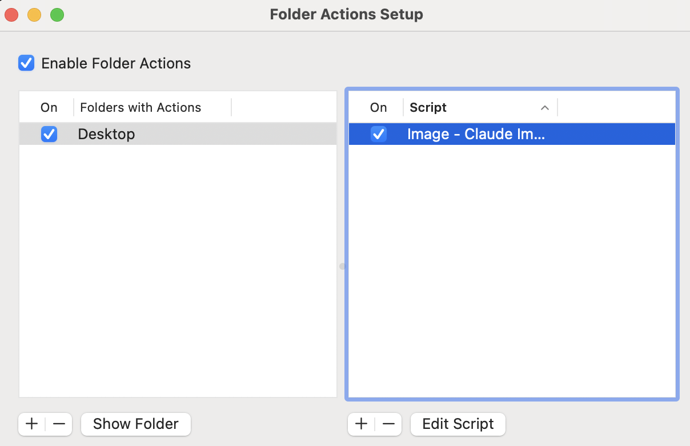

# macOS Folder Actions Setup for Claude Image Renamer

This directory contains a modified version of `claude-image-renamer` designed to work with macOS **Folder Actions**. When configured, screenshots saved to your Desktop are automatically renamed using Claude AI without any manual intervention.

## How It Works

When you take a screenshot on macOS (e.g., `Screenshot 2025-12-31 at 09.00.00.png`), the Folder Action detects the new file and automatically triggers the renaming script. The screenshot is analyzed using OCR and Claude's vision capabilities, then renamed to a descriptive, searchable filename.

## Files Included

| File | Description |
|------|-------------|
| `Image - Claude Image Renamer.scpt` | AppleScript that attaches to a folder and triggers on new files |
| `wrapper-claude-image-renamer.sh` | Wrapper script that sets up the environment and logs output |
| `claude-image-renamer.sh` | Modified version of the main renaming script |

## Differences from the Root Version

The `claude-image-renamer.sh` in this directory has been modified for Folder Actions compatibility:

| Aspect | Root Version | Folder Actions Version |
|--------|--------------|------------------------|
| **OCR file location** | Same directory as image | `/tmp/` directory (prevents re-triggering Folder Action) |
| **OCR binary path** | Uses `ocr` from PATH | Explicitly uses `$HOME/bin/ocr` |
| **Claude binary path** | Uses `claude` from PATH | Uses `${HOMEBREW_PREFIX}/bin/claude` |
| **File filtering** | Processes all provided files | Only processes files matching `Screenshot*.png` |

### Why These Changes?

1. **OCR file in `/tmp/`**: Creating a new `.ocr.txt` file in the watched folder would trigger another Folder Action event, causing an infinite loop.

2. **Explicit binary paths**: Folder Actions run in a minimal shell environment without the user's full PATH. Explicit paths ensure the binaries are found.

3. **Screenshot filtering**: Since Folder Actions trigger on *any* new file, the script filters to only process actual macOS screenshots.

## The Wrapper Script

`wrapper-claude-image-renamer.sh` makes it simpler to debug and log the file renaming process:

```bash
#!/bin/bash
eval "$(/opt/homebrew/bin/brew shellenv)"
export PATH="/opt/homebrew/bin:${PATH}"
${HOME}/bin/claude-image-renamer.sh "$@" >> /tmp/claude-image-renamer.log 2>&1
```

**Benefits:**
- Sets up Homebrew environment variables needed for the `claude` CLI
- Adds Homebrew binaries to PATH
- Redirects all output to `/tmp/claude-image-renamer.log` for debugging
- Allows you to monitor renaming activity with: `tail -f /tmp/claude-image-renamer.log`

## Installation

### Step 1: Install the AppleScript

Copy the Folder Action script to the system scripts directory (requires sudo):

```bash
sudo cp "folder_actions_setup/Image - Claude Image Renamer.scpt" "/Library/Scripts/Folder Action Scripts/"
```

### Step 2: Install the Shell Scripts

Copy the shell scripts to your `$HOME/bin` directory and make them executable:

```bash
mkdir -p ~/bin
cp folder_actions_setup/claude-image-renamer.sh ~/bin/
cp folder_actions_setup/wrapper-claude-image-renamer.sh ~/bin/
chmod 700 ~/bin/claude-image-renamer.sh
chmod 700 ~/bin/wrapper-claude-image-renamer.sh
```

### Step 3: Install the OCR Binary (Optional but Recommended)

Build and install the OCR tool for better rename accuracy:

```bash
make
cp ocr ~/bin/
chmod 700 ~/bin/ocr
```

### Step 4: Configure the Folder Action

1. Open **Folder Actions Setup** (search for it in Spotlight or find it in `/System/Library/CoreServices/Applications/`)

2. Check **Enable Folder Actions** at the top

3. Click the **+** button in the left pane to add a folder

4. Select your **Desktop** folder (or any folder where you save screenshots)

5. In the right pane, click **+** to attach a script

6. Select **Image - Claude Image Renamer** from the list

Your configuration should look like this:



## Verifying the Installation

1. Take a screenshot (Cmd+Shift+4 or Cmd+Shift+3)

2. Watch the log file for activity:
   ```bash
   tail -f /tmp/claude-image-renamer.log
   ```

3. The screenshot should be automatically renamed within a few seconds

## Troubleshooting

**Script not triggering:**
- Ensure "Enable Folder Actions" is checked
- Verify the script is attached to the correct folder
- Check that the AppleScript is in `/Library/Scripts/Folder Action Scripts/`

**Renaming fails:**
- Check the log file: `cat /tmp/claude-image-renamer.log`
- Ensure `claude` CLI is installed and authenticated
- Verify the shell scripts are executable: `ls -la ~/bin/*.sh`

**OCR not working:**
- Ensure the `ocr` binary is at `~/bin/ocr`
- Test it manually: `~/bin/ocr /path/to/image.png`
